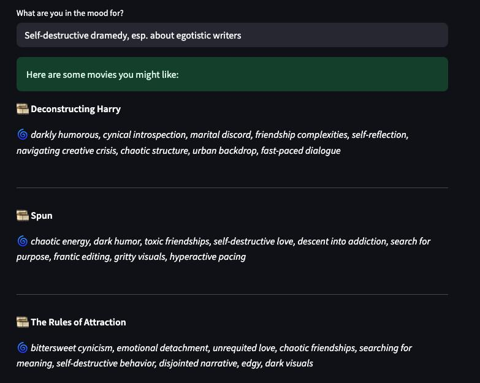

# 🎬 Emotion-Based Movie Recommender

> **✨ This project explores the trade-off between optimizing for accuracy (past behavior) and enabling human discovery (future growth).**
> 
> - Optimizing for clicks and past behavior can limit discovery  
> - Recommenders risk becoming echo chambers of taste  
> - We shift from predicting behavior to supporting emotional growth  
> - This tool helps people **name and explore** feelings — not just repeat them  
> 
> 💡 *Can we build a system that helps people say:*  
> “**That’s exactly how I needed to feel — and I didn’t even know it.**”

---

## 🚀 Try the App

🔗 [Launch the Emotion-Based Recommender App](https://emotion-movie-recommender-gnfazrztxfmeyghyf444xo.streamlit.app/)

> ⚠️ The app requires an OpenAI API key to function.  
> Add your API key as a secret in Streamlit:  
> Go to `Settings > Secrets` and add:
```
OPENAI_API_KEY = "your_key_here"
```

---

## 🖼️ Example Output

Here's an example of a user searching for:  
`Self-destructive dramedy, esp. about egotistic writers`



---

## 🔍 Problem

Traditional recommender systems often suggest movies by:
- Genre (e.g. "comedy", "thriller")
- User behavior (e.g. watch history, ratings)

But:
- **Genre ≠ emotional experience** — people crave specific emotional textures like "quiet intimacy" or "bittersweet closure"
- **Behavior ≠ true preference** — what users have watched may reflect social norms, not authentic taste

This project aims to recommend movies based on **emotional resonance**, not just past behavior.

---

## 🧠 Methodology

### 1. **Emotional Tagging with LLM**
We used the OpenAI API to tag ~5,000 TMDb movies using four emotional dimensions:

```json
\{
  "title": "Movie Title",
  "emotional_experience": ["deep grief", "hopeful release"],
  "relational_themes": ["estranged siblings"],
  "life_moments": ["coming to terms with loss"],
  "aesthetic": ["muted tones", "slow pacing"]
\}
```

### 2. **Embedding & Similarity Matching**
- Transformed tags into vector embeddings
- Stored movie vectors locally in a pickle-based database
- Compared user input embedding using **cosine similarity**
- Returned top 3 emotionally aligned movies

### 3. **User Interface**
- Lightweight app (e.g. Streamlit or CLI)
- Users describe the emotion they want to feel
- System recommends emotionally matched films

---

## 💡 Why Cosine Similarity?
Cosine similarity compares **angle** (not length) between vectors — perfect for capturing **semantic alignment** in text-based embeddings.  
Other distances (e.g. Euclidean) can distort meaning by over-weighting magnitude, especially in high-dimensional space.


## 🤝 Acknowledgements

Inspired by conversations about taste, art, and emotional truth — thank you **Chola Chisengalumbwe** who challenged our algorithmic way of seeing.

---

## 📬 Contact

Feel free to reach out with questions, suggestions, or emotional movie recs!  
[Lindsey Peng] – [lindseypeng873@gmail.com] – [https://www.linkedin.com/in/lindsey-peng-71382986/]
[Chola Chisengalumbwe]  – [https://www.linkedin.com/in/chola-chisengalumbwe-80049880/]
